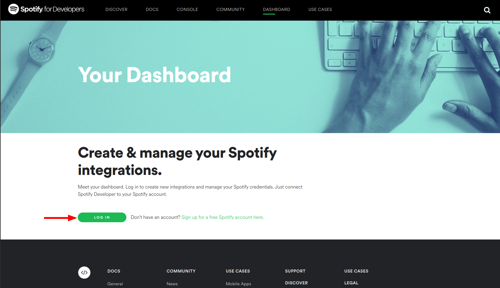
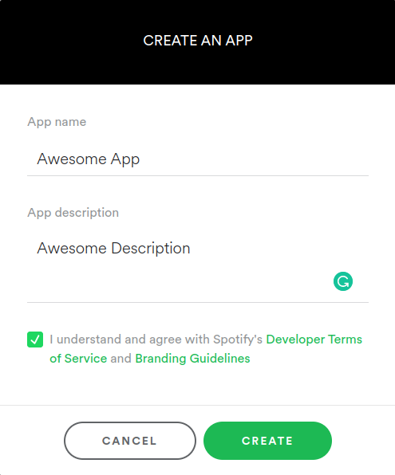
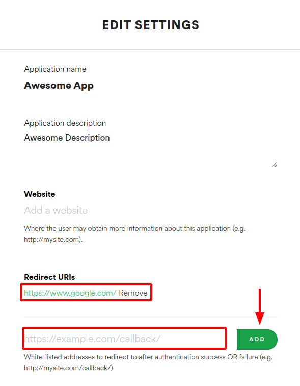
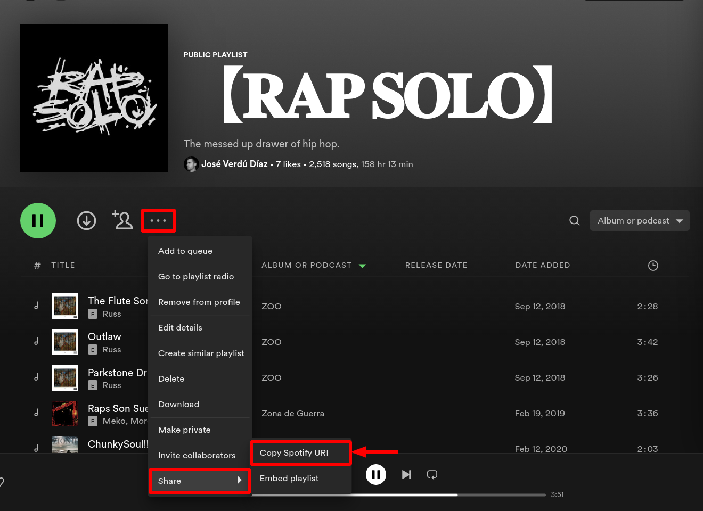



I'm the kind of Spotify user that adds every single song to one single playlist and then complains about not being able to find what he wants to hear. One simple solution would be grouping songs in different playlists by mood, however, this solution is not exciting enough for me... Instead, I decided to create an app that takes all tracks in a playlist, "analyzes" and groups them by similarity in an interactive 3D graph, where you can click on a song and automatically play it on Spotify. Ok, maybe that was too much to digest, let's decompose the problem:

- **Getting all tracks of a Spotify playlist**: Spotify offers an amazing [Web API][1] with an endpoint for requesting a list of tracks for a given playlist.
- **Analyze the tracks**: I might have lied here... we are not going to analyze and extract the features of the songs, as Spotify does not give access to the audio data. Instead, Spotify generates a set of song features using their :sparkles:*Corporate Secrets*:sparkles: which are accessible with the Web API.
- **Grouping tracks by similarity**: To group similar songs we will follow a [**dimensionality reduction**][2] strategy using the [UMAP][2] technique. We will use [Plotly][4] to create a 3D interactive graph of the UMAP result that will allow us to select individual songs.
- **Playing selected songs in Spotify**: We will use, again, the Spotify Web API to play the song we select in the Plotly graph.

:exclamation: Before moving forward: if you are planning to reproduce this project you might need a **premium Spotify account** to perform some of the API requests. Also, this project assumes you have an intermediate understanding of python, packet managing and other concepts.

With that being said, let's dive in!

---

## Setting up the Spotify Web API requirements

The Web API requests require **authentication** with an [OAuth][5] access token. To obtain a token we first need to log in to [Spotify for Developers Dashboard][6]:

Once we are logged in, we will click on "create an app" and a form will appear. We will give an awesome name and an awesome description to our app, and we will accept the Developer Terms of Service and Branding Guidelines after fully reading them :eyes:.

After accepting we will be redirected to the app's dashboard. There we will be able to find the `Client ID` and `Client Secret`. Note that both are blurred out, **you shouldn't share these values anywhere!** :speak_no_evil:

Write these values in a json file named `credentials.json`. If you are using git with your code and uploading the repository anywhere (GitHub, for example) **add the json file to the `.gitignore`!**


{
    "CLIENT_ID": "123456789abcdefghijklmnopqrstuvw",
    "CLIENT_SECRET": "123456789abcdefghijklmnopqrstuvw"
}


Click the "EDIT SETTINGS" button in the dashboard and add the following redirect URI: `https://www.google.com/`. This will be used during the authentication process.

With this done, we finished setting up the requirements for the Web API.

---

## Authenticating

First of all, we will load the credentials we stored before:


import json

with open('credentials.json', 'r') as f: credentials = json.load(f)
CLIENT_ID = credentials['CLIENT_ID']
CLIENT_SECRET = credentials['CLIENT_SECRET']


We will use [spotipy][7], a library that makes interacting with the API simpler. We define a `Spotify` object as follows:


import spotipy as spt

SCOPE = 'user-modify-playback-state user-library-read user-read-email user-read-private user-top-read user-modify-playback-state user-read-playback-state'
REDIRECT_URI = 'https://www.google.com/'

auth = spt.SpotifyOAuth(
    client_id=CLIENT_ID, client_secret=CLIENT_SECRET, 
    redirect_uri=REDIRECT_URI, 
    scope=SCOPE, open_browser=True, cache_path='.cache'
)
spotify = spt.Spotify(oauth_manager=auth)


The first time you perform a request using the `spotify` you will be requested to authenticate and a token will be generated. This token will be saved in the file specified in `cache_path` (in our case, in `.cache`). Again, if you are using git with your code and uploading the repository anywhere (GitHub, for example) **add the cache file to the `.gitignore`!** This authentication will happen only once, as spotipy takes care of refreshing the token when necessary.

The authentication process is simple: a web browser will be opened and we will copy the URL where we are redirected and paste it into an input box. Depending on your system, IDE or default browser... this process can fail. In my case, running the code from a `.ipynb` file in VS Code fails. To solve it, I run the code from a `.py` once.

Let's trigger the authentication process by performing a request:


spotify.track('4cOdK2wGLETKBW3PvgPWqT')


Done! Now you won't have to worry about authentication ever again!

---

## Obtaining data

First of all, we need to choose a playlist and get its URI. To do so, go to Spotify and choose a playlist, click on the "three dots" > Share > Copy Spotify URI. You might need to press the CTRL key for this option to appear.

Save the URI in a variable as follows:


PLAYLIST_ID = '7fE2CHD6t7eeHLD2ar8zSL'


We will use my persona Hip Hop playlist, which contains a huge variety of sub-styles from the old and new schools in the United States, Latin America and Spain. The playlist has a total 2517 tracks (at the moment of creating this blog post), so it should offer a nice amount of data points to work with.

Then we will construct a pandas DataFrame with the audio features and basic information of all tracks in the playlist:


import pandas as pd
from tqdm import tqdm

d = spotify.playlist_items(playlist_id=PLAYLIST_ID, limit=50)

data = []
n = math.ceil(d['total'] / 50)
for i in range(1, n + 1):
    for item in tqdm(d['items'], postfix=f'Request {i} of {n}'):
        track = item['track']

        f = spotify.audio_features(tracks=track['id'])[0]

        if f == None: continue

        features = {
            'danceability': f['danceability'],
            'energy': f['energy'],
            'key': f['key'],
            'loudness': f['loudness'],
            'mode': f['mode'],
            'speechiness': f['speechiness'],
            'acousticness': f['acousticness'],
            'instrumentalness': f['instrumentalness'],
            'liveness': f['liveness'],
            'valence': f['valence'],
            'tempo': f['tempo'],
            'track_name': track['name'],
            'artists_names': [],
            'album_name': track['album']['name'],
            'release_date': track['album']['release_date'],
            'track_id': track['id'],
        }

        for a in track['artists']: features['artists_names'].append(a['name'])

        data.append(features)
    
    d = spotify.playlist_items(playlist_id=PLAYLIST_ID, limit=50, offset=50*i)

df = pd.DataFrame(data)


Woah! That's a fair chunk to digest, let's explain it a little bit. The Spotify API request for retrieving tracks from a playlist has a maximum of 50 tracks. However, it has an `offset` parameter that allows us to change which is the first song requested. Using this little trick, we can calculate how many requests we need to download the full playlist! Note that I'm using [tqdm][8] for printing some progress bars. 

For each track, we save the following audio features:
 - **Danceability**: A confidence measure from 0.0 to 1.0 of whether the track is acoustic. 1.0 represents high confidence the track is acoustic.
 - **Energy**: A measure from 0.0 to 1.0 that represents a perceptual measure of intensity and activity. Typically, energetic tracks feel fast, loud, and noisy. For example, death metal has high energy, while a Bach prelude scores low on the scale. Perceptual features contributing to this attribute include dynamic range, perceived loudness, timbre, onset rate, and general entropy. 
 - **Key**: The key the track is in. Integers map to pitches using standard Pitch Class notation. E.g. 0 = C, 1 = C♯/D♭, 2 = D, and so on. If no key was detected, the value is -1.
 - **Loudness**: The overall loudness of a track in decibels (dB). Loudness values are averaged across the entire track and are useful for comparing the relative loudness of tracks. Loudness is the quality of a sound that is the primary psychological correlate of physical strength (amplitude). Values typically range between -60 and 0 db.
 - **Mode**: Indicates the modality (major or minor) of a track, the type of scale from which its melodic content is derived. Major is represented by 1 and minor is 0.
 - **Speechiness**: Detects the presence of spoken words in a track. The more exclusively speech-like the recording (e.g. talk show, audio book, poetry), the closer to 1.0 the attribute value. Values above 0.66 describe tracks that are probably made entirely of spoken words. Values between 0.33 and 0.66 describe tracks that may contain both music and speech, either in sections or layered, including such cases as rap music. Values below 0.33 most likely represent music and other non-speech-like tracks.
 - **Acousticness**: A confidence measure from 0.0 to 1.0 of whether the track is acoustic. 1.0 represents high confidence the track is acoustic.
 - **Instrumentalness**: Predicts whether a track contains no vocals. "Ooh" and "aah" sounds are treated as instrumental in this context. Rap or spoken word tracks are clearly "vocal". The closer the instrumentalness value is to 1.0, the greater likelihood the track contains no vocal content. Values above 0.5 are intended to represent instrumental tracks, but confidence is higher as the value approaches 1.0.
 - **Liveness**: Detects the presence of an audience in the recording. Higher liveness values represent an increased probability that the track was performed live. A value above 0.8 provides a strong likelihood that the track is live.
 - **Valence**: A measure from 0.0 to 1.0 describing the musical positiveness conveyed by a track. Tracks with high valence sound more positive (e.g. happy, cheerful, euphoric), while tracks with low valence sound more negative (e.g. sad, depressed, angry).
 - **Tempo**: The overall estimated tempo of a track in beats per minute (BPM). In musical terminology, the tempo is the speed or pace of a given piece and derives directly from the average beat duration.

Note that I copied these descriptions from the [API reference][9]. We also include other information: the track name, a list of artists' names, the album name, the release date and the track URI (the latter is a surprise tool that will help us later).

The downloading of the tracks can take a while (especially for large playlists), so it is interesting to save the data into a csv:


df.to_csv('data.csv', index=False)


The next time we what to run the code, it will be enough to load the csv:


df = pd.read_csv('data.csv')


---

## Exploratory Data Analysis

Ok, we already have the data, can we jump straight into grouping them with UMAP? **NO!** Let's have some fun with some exploratory data analysis first, we might get some interesting insights. I will use [Plotly][10] for plotting, as it allows me to generate interactive plots that can be inserted into this blog, but feel free to use your favorite library!

Let's visualize the distribution of the different features. Some features are bounded between 0 and 1, while others are unbounded. For this reason, I will separate the into different subplots.


import plotly.graph_objects as go
from plotly.subplots import make_subplots

features, values, track_name = [], [], []
for c in list(df.loc[:,:'tempo'].columns):
    features.extend([c for _ in range(len(df))])
    values.extend(list(df[c]))
    track_name.extend(list(df['track_name']))

outlier_df = pd.DataFrame(list(zip(features, values, track_name)), columns=['features', 'values', 'track_name'])

outlier_df_0 = outlier_df.loc[
    (outlier_df['features'] != 'tempo') & 
    (outlier_df['features'] != 'loudness') &
    (outlier_df['features'] != 'key')
    ]
outlier_df_1 = outlier_df.loc[(outlier_df['features'] == 'tempo')]
outlier_df_2 = outlier_df.loc[(outlier_df['features'] == 'loudness')]
outlier_df_3 = outlier_df.loc[(outlier_df['features'] == 'key')]

fig = make_subplots(rows=1, cols=4, column_widths=[0.7, 0.1, 0.1, 0.1])
fig.add_trace(
    go.Box(x=outlier_df_0['features'], y=outlier_df_0['values'], hovertext = list(outlier_df_0['track_name']), boxpoints='all'),
    row=1, col=1
)
fig.add_trace(
    go.Box(x=outlier_df_1['features'], y=outlier_df_1['values'], hovertext = list(outlier_df_0['track_name']), boxpoints='all'),
    row=1, col=2
)
fig.add_trace(
    go.Box(x=outlier_df_2['features'], y=outlier_df_2['values'], hovertext = list(outlier_df_0['track_name']), boxpoints='all'),
    row=1, col=3
)
fig.add_trace(
    go.Box(x=outlier_df_3['features'], y=outlier_df_3['values'], hovertext = list(outlier_df_0['track_name']), boxpoints='all'),
    row=1, col=4
)
fig.update_layout(height=700, showlegend=False)
fig.show()




First of all, one thing that pops up is how high the tempo values get: the song with the highest tempo ("93 till' Infinity" by Souls of Mischief) has around 206 BPM! This is an incredibly fast tempo for a Hip Hop song :confused:. Let's investigate further using this [webpage][11].

The instrumental version of the track has exactly half the BPM (which is, actually, the correct BPM). However, when performing a qualitative analysis (listening to the track) we can hear lots of rhythmic elements which give the sensation of a double-tempo. The conclusion is that, while the tempo metric might not be accurate, it's not perceptually wrong.

Another interesting relation to study is how loudness has increased over the years. In music production, the [Loudness War][12] explains how the audio level tends to increase over the years to give the consumer a false sensation of "better sounding". Let's see if we can observe this in our data!


year = []
for i in range(len(df)):
    y = df['release_date'][i].split('-')[0]
    if y == '0000': y = '2000' # Dirty NaN imputing
    year.append(y)

df['year'] = year

year_mean_df = df.groupby('year', as_index=False).mean()
year_min_df = df.groupby('year', as_index=False).min()
year_max_df = df.groupby('year', as_index=False).max()

x = list(year_mean_df['year'])
x_rev = x[::-1]
mean = list(year_mean_df['loudness'])
upper = list(year_max_df['loudness'])
lower = list(year_min_df['loudness'])
lower = lower[::-1]

fig = go.Figure()

fig.add_trace(go.Scatter(
    x=x+x_rev,
    y=upper+lower,
    fill='toself',
    fillcolor='rgba(0,100,80,0.2)',
    line_color='rgba(255,255,255,0)',
    showlegend=False
))
fig.add_trace(go.Scatter(
    x=x, y=mean,
    line_color='rgb(0,100,80)'
))

fig.update_traces(mode='lines', showlegend=False)
fig['layout'].update(height=800, autosize=True)

fig.show()




We can observe this tendency in our data too, with a clear increase from 1992 peaking in 2006. After this year, we observe how the loudness tends to fall again. This coincides with the decrease in popularity of the CD in favor of digital formats and streaming services, which make use of standardization techniques that makes pumping up the audio level unnecessary, as explained by this [article][13].

Finally, let's have a look at the correlation matrix of the variables.


import numpy as np
import plotly.figure_factory as ff

df_corr = df.loc[:,:'tempo'].corr()

x = list(df_corr.columns)
y = list(df_corr.index)
z = np.array(df_corr)

fig = ff.create_annotated_heatmap(
    z,
    x = x,
    y = y ,
    annotation_text = np.around(z, decimals=2),
    hoverinfo='z',
    colorscale='thermal'
    )
fig['layout'].update(height=800, width=800)
fig.show()




We can see a strong positive correlation between loudness and energy. Other than that, the heatmap does not reveal much more.

---

## UMAP
That is enough analysis for today, let's return to the objective of the post!

Before applying the UMAP we should normalize all features to the same range. There are many sophisticated ways of doing so to take into account outliers, but given the nature of our data let's go simple: the `minmax_scale` of `sklearn` will do.


from sklearn.preprocessing import minmax_scale

scaled = minmax_scale(df.loc[:,:'tempo'])
scaled = pd.DataFrame(scaled, columns=list(df.loc[:,:'tempo'].columns))

df_scaled = df.copy()
df_scaled.loc[:,:'tempo'] = scaled


Let's give a look to the new data:


import plotly.express as px

features, values, track_name = [], [], []
for c in list(df_scaled.loc[:,:'tempo'].columns):
    features.extend([c for _ in range(len(df_scaled))])
    values.extend(list(df_scaled[c]))
    track_name.extend(list(df_scaled['track_name']))

outlier_df = pd.DataFrame(list(zip(features, values, track_name)), columns=['features', 'values', 'track_name'])

fig = px.box(outlier_df, x="features", y="values", points="all", hover_data=['track_name'])
fig.show()




This looks a lot better! Don't hesitate to try different techniques, as this could be improved further. Now it's time to apply the UMAP to the data: 


from umap import UMAP

umap = UMAP(n_components=3)
proj_3d = umap.fit_transform(df_scaled.loc[:,:'tempo'])

proj_3d_df = pd.DataFrame(proj_3d, columns=['0', '1', '2'])
proj_3d_df['track_name'] = df['track_name']


And now, the moment of truth... Let's plot our UMAP:


f = go.FigureWidget()
f.add_trace(go.Scatter3d(
    x=proj_3d[:,0], y=proj_3d[:,1], z=proj_3d[:,2],
    mode = 'markers',
    hovertext = list(proj_3d_df['track_name'])
    ))
f['layout'].update(width=800, height=800, autosize=False)
f.for_each_trace(lambda t: t.update({"marker":{"size":1}}))

def click_callback(trace, points, selector):
    track = data[points.point_inds[0]]
    spotify.add_to_queue(uri=track['track_id'])
    spotify.next_track()
    print(f'Song: {track["track_name"]} | URI: {track["track_id"]}')

f.data[0].on_click(click_callback)

f




That is fantastic! :heart_eyes: Did you notice that `click_callback` function? Here is where our surprise tool comes handy. We added a click event on each data point that sends a request to spotify to change the currently playing track to the one selected. Keep in mind that you need to have spotify opened and playing for it to work and that this functionality won't work with this blog's plot! Are you starting to see the potential of this idea? Then wait, because we are going to make another step forward!

---

## Clustering

Before going ahead, it's time for a quick disclaimer: the validity of UMAP as a preprocessing step for clustering is something that it is currently being discussed by the scientific community. Some papers ([1][14]) claim to improve substantially the performance of multiple clustering algorithms by applying UMAP first. However, UMAP does not preserve distance nor density between data points, which can affect distance and density-based clustering algorithms ([2][15]). Having this said, let's move on!

We will use [HDBSCAN][16], which has proven to work very well with UMAP:


import hdbscan

labels = hdbscan.HDBSCAN(
    min_samples=5,
    min_cluster_size=20,
    gen_min_span_tree=True,
    cluster_selection_method='leaf'
).fit_predict(proj_3d)

if labels.min() == -1: labels += 1

proj_3d_df['labels'] = list(labels)
df['labels'] = list(labels)


Let's plot the results:


import seaborn as sns

color_palette = sns.color_palette('tab20', n_colors=len(np.unique(labels)))
color_palette[0] = (0.5, 0.5, 0.5)
colors = [f'rgb({c[0]*255},{c[1]*255},{c[2]*255})' for c in color_palette]

fig=go.FigureWidget()
for i in list(np.unique(labels)):
    dfp = proj_3d_df[proj_3d_df['labels']==i]
    fig.add_traces(go.Scatter3d(
        x=dfp['0'], y=dfp['1'], z=dfp['2'],
        mode = 'markers',
        hovertext = list(dfp['track_name']),
        name=f'{i}',
        marker_color=colors[i]
    ))
fig['layout'].update(width=800, height=800, autosize=False)
fig.for_each_trace(lambda t: t.update({"marker":{"size":2}}))

def click_callback(trace, points, selector):
    if len(points.point_inds) > 0:
        dfp = df[df['labels'] == points.trace_index]
        track = dfp.iloc[points.point_inds[0]]

        spotify.add_to_queue(uri=track["track_id"])
        spotify.next_track()
        print(f'Song: {track["track_name"]} | URI: {track["track_id"]}')

for t in fig.data: t.on_click(click_callback)

fig




Not that bad! There are a lot of tracks that have been clustered as "outliers". These are represented by the label "0", and can be hidden by clicking the corresponding label in the legend.

---

## To Do

Thank you for reading this post! I think this is an idea with a lot of potential that needs improving and polishing. I might try in the future and write a new post about this, but in the meantime, these are some things you can try out!

 - Try with your own playlists! The playlist we used only contains Hip Hop, so why not try a more variate one? Fill a playlist with Debussy and Skrillex and try again!
 - My standardization process was extremely basic, try more complex and specialized techniques, and the results might improve.
 - UMAP has multiple parameters that can be tweaked to improve the results, and I haven't bothered to experiment with them, why not try them out?
 - HDBSCAN also has multiple parameters to play with. I found good results with the ones I've chosen, but I didn't do exhaustive research.
 - Include new features, or exclude existing features, in the analysis.

See you at the next one!

[1]: https://developer.spotify.com/documentation/web-api/
[2]: https://en.wikipedia.org/wiki/Dimensionality_reduction
[3]: https://arxiv.org/abs/1802.03426
[4]: https://plotly.com/python/
[5]: https://oauth.net/
[6]: https://developer.spotify.com/dashboard/
[7]: https://spotipy.readthedocs.io
[8]: https://tqdm.github.io/
[9]: https://developer.spotify.com/documentation/web-api/reference/#/operations/get-several-audio-features
[10]: https://plotly.com/python/getting-started/
[11]: https://songbpm.com/
[12]: https://en.wikipedia.org/wiki/Loudness_war
[13]: https://www.mixonline.com/news/loudness-war-over-420885
[14]: https://link.springer.com/chapter/10.1007/978-3-030-51935-3_34
[15]: https://stats.stackexchange.com/questions/263539/clustering-on-the-output-of-t-sne
[16]: https://hdbscan.readthedocs.io/en/latest/index.html