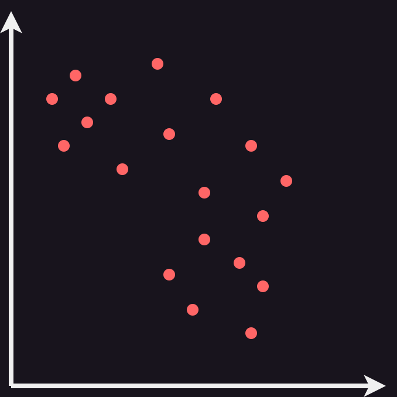
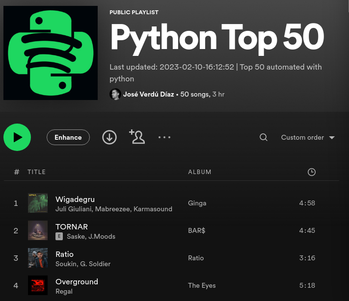



Spotify spits dozens of playlists with recommendations every day, but because I'm nonconformist by nature (and a bit of a nerd) I **need** to have some custom playlist recommendation system. In this post, I will show you how to create an automatic Top 50 songs playlist using the spotify API and Python. In addition, we will implement a [Nearest Neighbour](https://en.wikipedia.org/wiki/Nearest_neighbour_algorithm) algorithm to sort the tracks by similarity and improve the song transitions in the playlist.

## Setting up the Spotify Web API requirements

There are some steps required to use the Spotify API, please refer to the last post: [Improving Spotify with UMAP v1](), sections "Setting up the Spotify Web API requirements" and "Authenticating".

The only difference with the last post will be the definition of the `SCOPE` variable, as we will have to add `playlist-modify-public`:


SCOPE = 'user-modify-playback-state user-library-read user-read-email user-read-private user-top-read user-modify-playback-state user-read-playback-state playlist-modify-public'


If you follow the steps defined in the last post, you should en up with an authenticated `spotify` object.

## Getting the top 50 tracks

The Spotify API offers an [endpoint](https://developer.spotify.com/documentation/web-api/reference/#/operations/get-users-top-artists-and-tracks) for retrieving the top tracks and artists of an user based on "affinity". How is this "affinity" calculated? Well, I guess it's another :sparkles:*Corporate Secret*:sparkles: that Spotify is not willing to reveal. The API request allows for 3 different time periods for the affinity measurement: long term, medium term and short term. We will used the short term period, which uses the user playing history of the last 4 weeks.

In addition, we will use the API endpoint that allows to extract the "audio features" (again, more :sparkles:*Corporate Secrets*:sparkles: involved) of the top tracks, as we did on the last [post](). We will use this feature in the next section to sort the playlist by track similarity.


import pandas as pd
from tqdm import tqdm

top_tracks = spotify.current_user_top_tracks(limit=50, time_range='short_term')

data = []
for item in tqdm(top_tracks['items']):
    if item['id'] == None: continue

    f = spotify.audio_features(tracks=item['id'])[0]

    features = {
        'danceability': f['danceability'],
        'loudness': f['loudness'],
        'speechiness': f['speechiness'],
        'acousticness': f['acousticness'],
        'instrumentalness': f['instrumentalness'],
        'valence': f['valence'],
        'tempo': f['tempo'],
        'track_name': item['name'],
        'artists_names': [],
        'album_name': item['album']['name'],
        'release_date': item['album']['release_date'],
        'track_id': item['id'],
    }

    for a in item['artists']: features['artists_names'].append(a['name'])

    data.append(features)

df = pd.DataFrame(data)


## Sorting by similarity

Now, this is the interesting part. Don't you hate holding your tears during a ballad just to be hit in the face by a hard rock track right after? I do. Let's do something about it. The objective is to sort the tracks in a way that does not lead to drastic changes. At our hand, we have the features that Spotify calculates for each track. An approach to this problem is to implement a [Nearest Neighbour](https://en.wikipedia.org/wiki/Nearest_neighbour_algorithm).


stateDiagram-v2
state "1: Create a pool of tracks" as s1
state "2: Select random track" as s2
state "3: Iterate Tracks" as s3
state "4: Find distance" as s4
state "5: Keep nearest" as s5
state "6: Select nearest track and remove from pool" as s6
[*] --> s1
s1 --> s2
s2 --> s3
s3 --> s4
s4 --> s5
s5 --> s3
s3 --> s6
s6 --> s3
s6 --> [*]


We will be dealing with a 7-dimensional space, but for the sake of simplicity we can visualize this algorithm in a 2-dimensional image:

Is this algorithm optimal? Absolutely not. The paths are chosen in a greedy way, without any consideration for global structure. This means that some nodes might be left isolated. Luckily, we are not interested in finding the shortest path that connects all tracks, so this simple algorithm will do the job.


import numpy as np
from scipy.spatial import distance
from sklearn.preprocessing import StandardScaler

features = df.loc[:, :'tempo'].copy()
features_scaled = StandardScaler().fit_transform(features)

pool = pd.DataFrame(features_scaled.copy())
pool[7] = list(range(len(pool)))
pool = pool.to_numpy()

order = []
i = np.random.randint(0, high=pool.shape[0])
order.append(pool[i])
pool = np.delete(pool, i, axis=0)

while len(order) < features_scaled.shape[0]:
    for i in range(pool.shape[0]):
        dist = distance.euclidean(order[-1][:-1], pool[i][:-1])
        if i == 0: 
            best = (dist, i)
            continue
        if dist < best[0]: best = (dist, i)
    
    order.append(pool[best[1]])
    pool = np.delete(pool, best[1], axis=0)

df['order'] = pd.DataFrame(order)[7]

df.sort_values(by='order', inplace=True)
df.reset_index(inplace=True)


## Creating the automated spotify playlist

After the last step, we are left with a dataframe of our top 50 tracks sorted by similarity. Now, we need to populate programatically a spotify playlist. For that, first create an empty playlist and copy the URI. We can use the spotify API to replace all existing songs in a playlist by a new set of tracks, as well as for updating the playlist description with the date of the code execution.


PLAYLIST_URI = '1GIjZH2SNNzh4ux9jAf2Ed'

ids = [df.iloc[i]['track_id'] for i in range(len(df))]
spotify.user_playlist_replace_tracks(user='fosfatinador', playlist_id=PLAYLIST_URI, tracks=ids)
spotify.user_playlist_change_details(
    user='fosfatinador', 
    playlist_id=PLAYLIST_URI, 
    description=f'Last updated: {datetime.today().strftime("%Y-%m-%d-%H:%M:%S")} | Top 50 automated with python'
)


